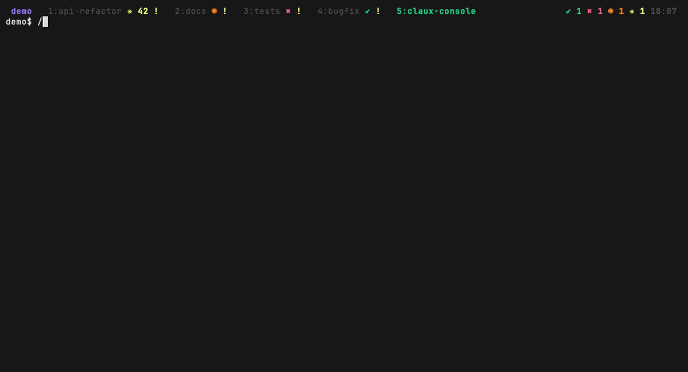
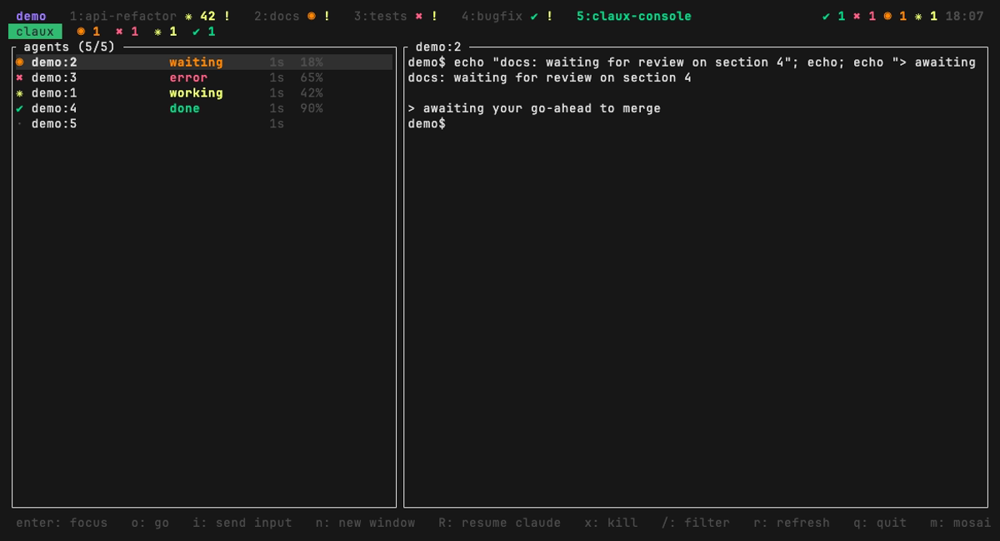
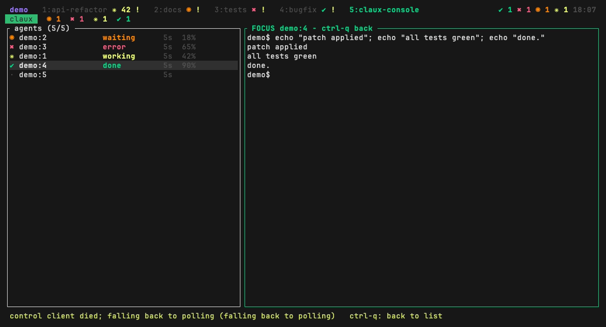

# claux

A tmux frontend for agentic coding workflows (claude + tmux).

The premise: your agents are just tmux windows. You open a window, run your
agent in it (Claude Code or anything else), move on to the next one. claux
is the console on top of that: it renders every window in every session of
your tmux server, sorted by urgency, with a live preview of the selected
window's pane, a focus mode that drives an agent without attaching, and
per-agent cost tracking.

claux is a pure OBSERVER: the state comes from the `@agent_state` and
`@agent_ctx` window options that Claude Code lifecycle hooks maintain, so
there is no terminal scraping, no heuristics, and nothing to lose if claux
dies - tmux remains the single source of truth.

States, most urgent first: waiting, error, working, compacting, done, idle.



| Agent list | Focus mode |
|---|---|
|  |  |

## Install

```sh
cargo install --path .
```

## Quickstart

claux needs nothing beyond tmux and the state hooks: no custom scripts, no
special tmux config.

1. Merge the `hooks` object from
   [contrib/claude-code/settings-hooks.json](contrib/claude-code/settings-hooks.json)
   into your `~/.claude/settings.json`. Optionally install
   [contrib/claude-code/statusline.sh](contrib/claude-code/statusline.sh)
   too, for the context-percentage column.
2. Open tmux windows and run `claude` in them, as many as you like.
3. Run `claux` in a terminal outside tmux (or see Usage for in-tmux ways).

How you create the windows is your business: by hand, from scripts, one git
worktree per agent, whatever. claux only reads what tmux already knows, so
any workflow that ends in "an agent running in a tmux window" works.

## Usage

Run `claux` in any plain terminal outside tmux and it becomes your primary
console: enter attaches the real tmux client to the selected window in that
same terminal, so every tmux binding works exactly as normal (it IS tmux).
prefix+d detaches and drops you straight back into claux with a fresh list;
if the session dies, claux resumes the same way. Outside tmux claux is
always persistent, since a one-shot exit would strand you in a dead shell.

Inside tmux, two more ways to run it:

```tmux
# One-shot picker in a popup: enter jumps and closes.
bind A display-popup -E -w 90% -h 80% "claux"

# Persistent console in its own session: actions leave it running.
bind C-a if-shell "tmux has-session -t claux 2>/dev/null" \
  "switch-client -t claux" \
  "new-session -d -s claux -n console 'claux --console'; switch-client -t claux"
```

Keys: enter opens focus mode on the selected window (see below), o jumps
to the window / attaches (the old enter behavior), i types a line into the
selected agent's pane without attaching (empty line = just Enter, to accept
a default), n opens a new window in the selected window's directory, R sends
`claude --continue` (resume an agent after a reboot/restore), x kills,
/ filters, j/k move, g/G first/last, r forces a refresh, q/esc quits,
m opens mosaic mode (see below).
The list auto-refreshes every 500ms; the header shows fleet counters and,
when any window reports a transcript, a fleet-wide cost total. Each row
shows its own accumulated USD cost next to the context percentage, when
available (see Cost tracking below). Each row also shows a timeline strip
and state age, and flags a stalled working agent as `stuck!` (see Timeline
below). The mouse works too (see Mouse below).

## Mouse

Click a row in the list to select it, click it again to enter focus mode
(the same gesture works on a mosaic cell). The scroll wheel moves the
selection up and down. Drag the border between the list and the preview to
resize the split. In focus mode the mouse is ignored; use the keyboard.

## Focus mode (control mode)

Enter on a selected window opens focus mode: the preview pane gets a green
bold border and every key you press (including Esc, Tab, arrows and Ctrl
combinations) is forwarded straight to that agent's tmux pane via
`send-keys`, with no `tmux attach` involved. The window list stays visible
on the left the whole time. Ctrl-q exits focus mode back to the list.

The preview itself is rendered through a `tmux -C` control-mode client (the
same model iTerm2 uses for `tmux -CC`): on entering focus, claux attaches a
control client to the window's session, tells tmux to resize the window to
the preview panel's exact size (`refresh-client -C`), and feeds the pushed
`%output` bytes into an in-memory terminal emulator (vt100) that is rendered
cell by cell. Because tmux is resizing the real pane to match the preview
column, wrapping is always exact, and because updates are pushed instead of
polled, output feels live with no fixed refresh interval. The control client
stays alive across ctrl-q so re-entering focus is instant; it is only killed
when claux exits.

If the control client cannot be started or dies mid-focus, claux falls back
to the previous capture-pane polling preview and shows a warning in the
footer; wrapping accuracy in that fallback depends on the preview column
matching the pane's real width, same as before.

## Notifications

When a window's agent state transitions into waiting, error or done, claux
fires a best-effort desktop notification (`osascript` on macOS, `notify-send`
elsewhere). Other transitions (working, compacting, idle) stay silent to
avoid churn. Pass `--no-notify` to disable notifications entirely. Since the
fleet poll pauses while in focus mode, no notifications fire during focus.

## Mosaic mode

`m` opens a live 2x2 grid of the 4 most urgent agents, one `tmux -C` control
client per session backing the cells. Panes are never resized to fit the
grid, so a cell crops to the bottom-left corner of the real pane instead of
rewrapping it. Mosaic is view-only: it never forwards keys to the agents.
`h`/`j`/`k`/`l` move the selection between cells, enter jumps into focus
mode on the selected cell, and `m` or esc goes back to the list.

## Cost tracking

Claude Code hooks publish each session's transcript path as the
`@agent_transcript` window option. When it is set, claux parses that
transcript incrementally and shows the accumulated USD cost per agent in the
list, plus a fleet total in the header. Figures are approximations computed
at standard first-party API rates from the transcript's own usage blocks.
Windows without the option simply show no cost.

## Timeline

Each row shows a 5-minute strip of the agent's recent states: 10 buckets of
30 seconds, colored the same as the state icons, followed by how long the
agent has been in its current state. A working agent whose pane has produced
no output for 5 minutes is flagged as `stuck!` in red, using tmux's own
`window_activity` timestamp. History lives only in claux's memory and starts
fresh when claux starts.

## Surviving reboots

claux itself has nothing to lose: all state lives in the tmux server.
Pair it with tmux-resurrect/continuum so sessions, windows and directories
come back after a reboot, then use R on each restored agent window to
resume its conversation (`claude --continue`).

## How state gets there (wiring it up)

claux draws nothing by itself: something has to publish state into three
tmux window options. The protocol is tiny and agent-agnostic:

- `@agent_state`: one of `working`, `waiting`, `error`, `done`,
  `compacting`, `idle`. Windows without it are ignored.
- `@agent_ctx` (optional): used-context percentage, an integer like `42`.
- `@agent_transcript` (optional): path to a Claude Code transcript JSONL,
  enables the cost column.

For Claude Code, [contrib/claude-code](contrib/claude-code) has a
ready-made setup:

- `settings-hooks.json`: lifecycle hooks that keep `@agent_state` and
  `@agent_transcript` current. Merge the `hooks` object into your
  `~/.claude/settings.json`.
- `statusline.sh`: a statusLine command that also publishes `@agent_ctx`.
  Copy it anywhere, `chmod +x` it, and reference it from settings.

Every hook no-ops outside tmux (`[ -n "$TMUX_PANE" ]`), so the same config
is safe in plain terminals. Any other agent or script that sets
`@agent_state` on its window shows up the same way - claux does not know
what Claude Code is.

## Roadmap

- Push updates via tmux control mode subscriptions (`refresh-client -B`)
  instead of the 500ms tick.
- Send keys to a blocked agent from the list without attaching.
- Fleet counters and per-window cost/tokens from Claude Code transcripts.

## License

MIT, see [LICENSE](LICENSE).
